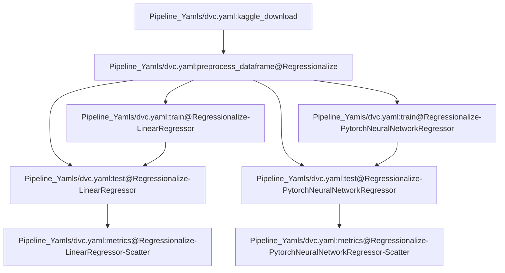

# jane_kaggle
A simple DVC structure for [Jane Street's "Real Time Market Data Forcecasting" Kaggle competition](https://www.kaggle.com/competitions/jane-street-real-time-market-data-forecasting). The project's goal is to predict the "responder_6" label on unseen samples. This repo serves as the main project page, while some generic utility functions are available in [gilg_utilities](https://github.com/bradygilg/gilg_utilities).

The purpose of this repo is to demonstrate the basic elements of reproducibility and code sharing. The reproducibility elements are:

1. Code reproducibility - All code is accessible in this repo or gilg_utilities.
2. Environment reproducibility - Dependencies are specified in the [frozen requirements](https://github.com/bradygilg/jane_kaggle/blob/main/frozen_requirements.txt). The pyproject.toml and requirements.txt generated by pip-tools are available as well if modifications need to be made.
3. Data reproducibility - Commands to download and preprocess data are the first two stages in the [dvc.yaml](https://github.com/bradygilg/jane_kaggle/blob/main/Pipeline_Yamls/dvc.yaml).
4. Pipeline reproducibility - The same [dvc.yaml](https://github.com/bradygilg/jane_kaggle/blob/main/Pipeline_Yamls/dvc.yaml) includes downstream stages for analysis, and the pipeline parameters are stored in [params.yaml](https://github.com/bradygilg/jane_kaggle/blob/main/Pipeline_Yamls/params.yaml).

## Installation

An explicit pip environment is provided in frozen_requirements.txt. To install, clone this repo and then run

`pip install -r frozen_requirements.txt`

A pyproject.toml is also provided if modifications to the environment are required. To regenerate the requirements using [pip-tools](https://github.com/jazzband/pip-tools), run

`pip install pip-tools`

`pip-compile -v -o requirements.txt pyproject.toml`

`pip install -r requirements.txt`

## Usage

To reproduce the analysis pipeline, run

`dvc repro Pipeline_Yamls/dvc.yaml`

This will reproduce the research pipeline starting from the data download and ending with figure generation. The data download requires 12 GB of space, a Kaggle account, and a proper [Kaggle authentication JSON](https://www.kaggle.com/docs/api).

This repro does not have saved checkpoints available in a remote, so `dvc pull` will not work.

## Structure

This project is managed by a [pipeline file](https://github.com/bradygilg/jane_kaggle/blob/main/Pipeline_Yamls/dvc.yaml) that runs [individual scripts](https://github.com/bradygilg/jane_kaggle/blob/main/Scripts) according to a [parameters file](https://github.com/bradygilg/jane_kaggle/blob/main/Pipeline_Yamls/params.yaml). 

The final performance metrics on cross-fold test data are available in [Figures](https://github.com/bradygilg/jane_kaggle/blob/main/Figures).

